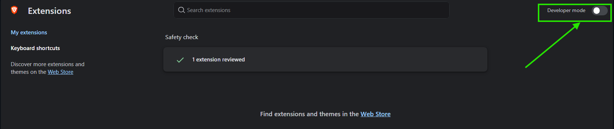
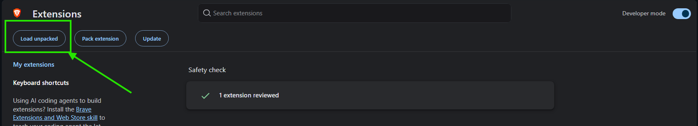
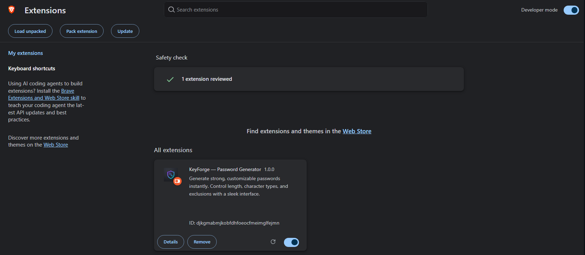

<p align="center">
  
</p>

<h1 align="center">KeyForge — Password Generator</h1>

<p align="center">
  <strong>A sleek Chrome extension that generates strong, customizable passwords instantly.</strong>
</p>

<p align="center">
  
  
  
  
</p>

---

## ✨ Features

| Feature | Description |
|---|---|
| 🔐 **Crypto-Secure** | Uses the Web Crypto API (`crypto.getRandomValues`) — no `Math.random()` |
| 📏 **Adjustable Length** | Slider + input from **6 to 64** characters |
| 🔤 **Character Types** | Toggle uppercase, lowercase, numbers, and symbols independently |
| 🚫 **Smart Exclusions** | No repeating chars · No ambiguous chars (`l`, `1`, `I`, `O`, `0`) · No sequential chars (`abc`, `123`) · Force first character to be a letter |
| ✏️ **Custom Exclusions** | Type any characters you want excluded from generation |
| 💪 **Strength Meter** | Real-time entropy-based strength bar (Weak → Excellent) |
| 📋 **One-Click Copy** | Copy to clipboard with a toast confirmation |
| 💾 **Persistent Settings** | Your preferences are saved via `chrome.storage` and restored on every popup open |
| ⚡ **Auto-Generate** | A fresh password is generated every time you open the extension |
| ⌨️ **Keyboard Shortcut** | Press `Enter` to regenerate instantly |

---

## 🖼️ Preview

<p align="center">
  <em>Premium dark UI with a violet-to-cyan accent gradient.</em>
</p>

<!-- Replace the path below with an actual screenshot if you have one -->
<!--
<p align="center">
  
</p>
-->

---

## 🚀 Installation

### 1 · Clone the repository

```bash
git clone https://github.com/yahyamsahal/password-generator.git
```

### 2 · Load in Developer Mode

<details open>
<summary><strong>🌐 Google Chrome</strong></summary>

1. Open Chrome and go to **`chrome://extensions`**
2. Toggle **Developer mode** ON (top-right corner)

   

3. Click **Load unpacked**

   

4. Select the cloned `password-generator` folder
5. KeyForge should now appear in your extensions list ✅

   

6. Click the 🧩 **Extensions** puzzle icon in the toolbar and **pin** KeyForge

</details>

<details>
<summary><strong>🦁 Brave Browser</strong></summary>

The steps are identical — just use **`brave://extensions`** instead of `chrome://extensions`.

1. Open Brave and go to **`brave://extensions`**
2. Toggle **Developer mode** ON (top-right corner)
3. Click **Load unpacked**
4. Select the cloned `password-generator` folder
5. Click the 🧩 **Extensions** puzzle icon in the toolbar and **pin** KeyForge

</details>

> **Tip:** Both browsers are Chromium-based, so the process is identical — only the URL in the address bar differs.

---

## 🛠️ Usage

1. Click the **KeyForge** icon in the Chrome toolbar
2. A password is **auto-generated** with your saved preferences
3. Adjust settings as needed:
   - Drag the **length slider** or type a number directly
   - Toggle character types on/off (uppercase, lowercase, numbers, symbols)
   - Enable exclusion rules (no repeats, no ambiguous, no sequential, start with letter)
   - Add custom characters to exclude
4. Click **⚡ Generate Password** or press **Enter** to create a new one
5. Click the **📋 copy** button to copy the password to your clipboard

---

## 📁 Project Structure

```
password-generator/
├── manifest.json        # Chrome Extension Manifest V3 config
├── popup.html           # Extension popup UI
├── popup.css            # Premium dark theme styles
├── popup.js             # Password generation logic & event handling
├── icons/
│   ├── icon16.png       # Toolbar icon (16×16)
│   ├── icon48.png       # Extensions page icon (48×48)
│   └── icon128.png      # Chrome Web Store icon (128×128)
└── README.md
```

---

## 🔧 Tech Stack

- **HTML5** — Semantic markup with inline SVG icons
- **Vanilla CSS** — Custom properties, glassmorphism-inspired dark theme, gradient accents, smooth animations
- **Vanilla JavaScript** — Zero dependencies, IIFE module pattern
- **Web Crypto API** — Cryptographically secure random number generation
- **Chrome Extensions Manifest V3** — Modern extension APIs (`clipboardWrite`, `storage`)

---

## 🔒 How It Works

1. **Character pool** is built from the enabled character types, minus any excluded characters
2. **At least one character** from each enabled category is guaranteed in every password
3. Remaining characters are drawn from the pool using **`crypto.getRandomValues()`**
4. The result is **Fisher-Yates shuffled** (also crypto-seeded) to eliminate positional bias
5. Constraint passes (no-sequential, begin-with-letter) are applied post-shuffle
6. **Entropy** is calculated as `length × log₂(poolSize)` with a pattern penalty for low uniqueness ratios

---

## 🤝 Contributing

Contributions, issues, and feature requests are welcome!

1. Fork the repository
2. Create your feature branch (`git checkout -b feature/amazing-feature`)
3. Commit your changes (`git commit -m "Add amazing feature"`)
4. Push to the branch (`git push origin feature/amazing-feature`)
5. Open a **Pull Request**

---

## 📄 License

This project is licensed under the [MIT License](LICENSE).

---

<p align="center">
  Made by <a href="https://github.com/yahyamsahal">yahyamsahal</a>
</p>
